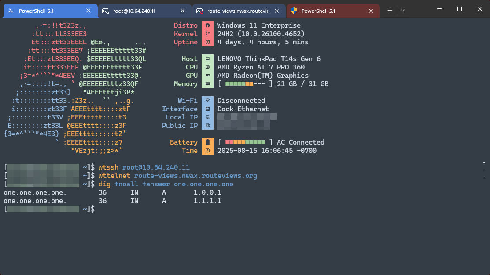
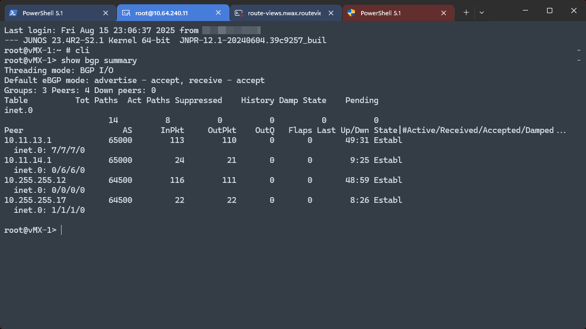
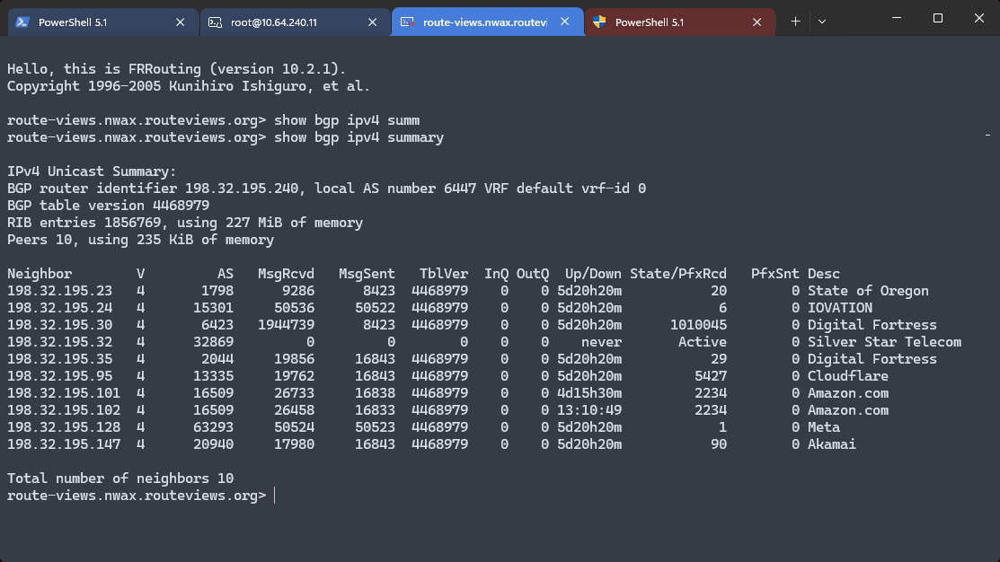
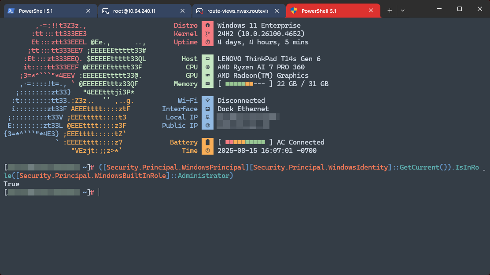

# Windows Terminal, PowerShell and OpenSSH Profiles


*Opening SSH and Telnet sessions and using WSL tools from PowerShell*


*An SSH session*


*A Telnet session*


*A PowerShell session with administrative privileges*


## Installation
1. Install the dependencies listed below
2. Copy the contents of `UserProfile` to `%UserProfile%`
3. Copy the contents of `WSLHome` to `~` inside the WSL image
4. [OPTIONAL] Apply the included registry file to register Windows Terminal to automatically handle `ssh://` and `telnet://` protocol links

### Dependencies
#### Host
- PowerShell 5.1
- Windows Terminal
- OpenSSH Client
- [CaskaydiaCove Nerd Font](https://www.nerdfonts.com/)
- [fastfetch](https://github.com/fastfetch-cli/fastfetch)
- [plink](https://www.chiark.greenend.org.uk/~sgtatham/putty/latest.html) (for `wttelnet` and `wtcom`)

#### WSL
- [WSL](https://learn.microsoft.com/en-us/windows/wsl/install)
- [Rocky Linux WSL Image](https://rockylinux.org)
- `bgpq4`, `fastfetch`, `iperf3`, `mtr`:
```
sudo dnf config-manager --set-enabled crb
sudo dnf install epel-release iperf3 mtr
sudo dnf install bgpq4 fastfetch
```

## Usage
- Aliases:
    - `grep` --> `Select-String`
    - `ll` --> `Get-ChildItem`
    - `subl|sublime` --> [Sublime Text](https://www.sublimetext.com/)
    - `which` --> `Get-Command`
- WSL Aliases:
    - `bgpq4`
    - `dig`
    - `iperf3`
    - `mtr`
    - `whois`
    - **Note:** All WSL aliases use a distribution named `rocky` by default. That distribution must exist and have the above tools installed for these to function.
- `wtssh`: Wrapper for OpenSSH that spawns a new tab
    - `-t`, `--title`: Set a custom title for the tab
    - Parses an SSH URI argument (`ssh://`)
    - All additional arguments are forwarded to OpenSSH
- `wttelnet|wttel`: Wrapper for `plink -telnet` that spawns a new tab
    - `--title`: Set a custom title for the tab
    - Parses a telnet URI argument (`telnet://`)
    - All additional arguments are forwarded to plink
- `wtcom|wtser`: Wrapper for `plink -serial` that spawns a new tab
    - `-Port`: The COM device number, default: `4`
    - `-BaudRate`: The baud rate, default: `9600`
    - `-DataBits`: The number of bits per character, default: `8`
    - `-Parity`: The parity mechanism behaviour, one of:
        - `n`: None (default)
        - `o`: Odd
        - `e`: Even
        - `m`: Mark
        - `s`: Space
    - `-StopBits`: The number of stop bits, one of `1`, `1.5`, or `2`, default: `1`
    - `-FlowControl`: Flow control mechanism, one of:
        - `N`: No flow control
        - `X`: Software XON/XOFF flow control (default)
        - `R`: Hardware RTS/CTS flow control
        - `D`: Hardware DSR/DTR flow control
- `Compare-FileHash`: Compare two files, or a file to a hash string
    - `-Algorithm`: Hash algorithm to use, default: `SHA256`
    - `-Path`: Path to the first (or only) file to compare, may also be piped in via stdin
    - `-Compare`: Path to the second file, or a hash string, to compare against
- Other Utilities:
    - `head`, `tail`, `wc`: Basic clones of standard POSIX tools
    - `Get-UserPrincipleName`: Get the UPN of the current user
